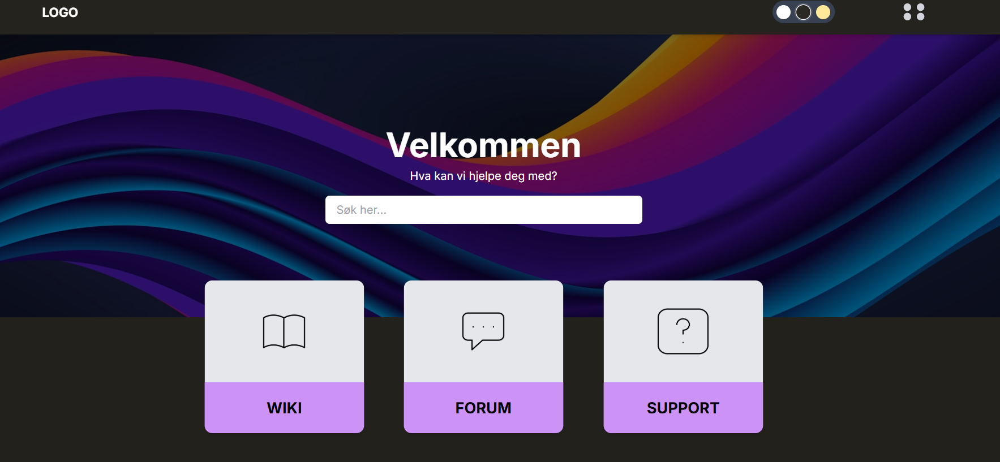

# Wiki Forum React App



## Installation

1. **Clone the repository:**
   ```bash
   git clone <repo-url>
   cd wiki-forum-main
   ```

2. **Install dependencies:**
   ```bash
   npm install
   ```

3. **Start the development server:**
   ```bash
   npm run dev
   ```
   The app will be available at [http://localhost:5173](http://localhost:5173) (or the port shown in your terminal).


